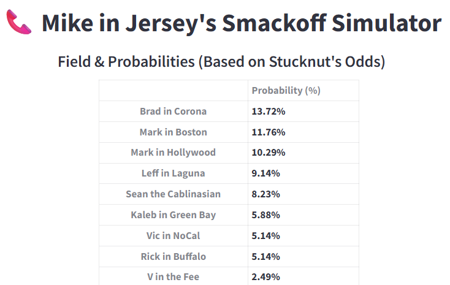

## Smackoff 30 - Streamlit Simulation

This is a Streamlit-based simulation of the Smackoff, the annual contest featuring the Jim Rome Show's best callers competing for $5,000 (and a Wingman watch). 

This simulates Smackoff 30, which was won by Brad in Corona. I took odds published by Jungle historian [Stucknut](https://www.stucknut.com/jimrome/smackoff/) and converted them into win probabilities for each Smackoff caller. Those probabilities were used as weights in a "random" draw that predicted the winner. 

It's a similar concept to the NBA draft lottery, which is weighted with some teams getting more ping-pong balls than others. In this case, the callers with higher probabilities had a stronger chance of being picked as the predicted Smackoff winner. 

## How It Works

I used a demo of this application as my Smackoff prediction video, and it aired on the Jim Rome Show. Because this was Smackoff 30, I used 30 as the seed argument in the numpy.random() function call. The random seed ensures that the result is the same each time in case we need to reproduce results. Defending champion Mark in Boston, who had the third-highest probability, was the predicted winner. So my prediction was wrong. However, if my seed argument had been 29, the prediction would have been Brad in Corona.
